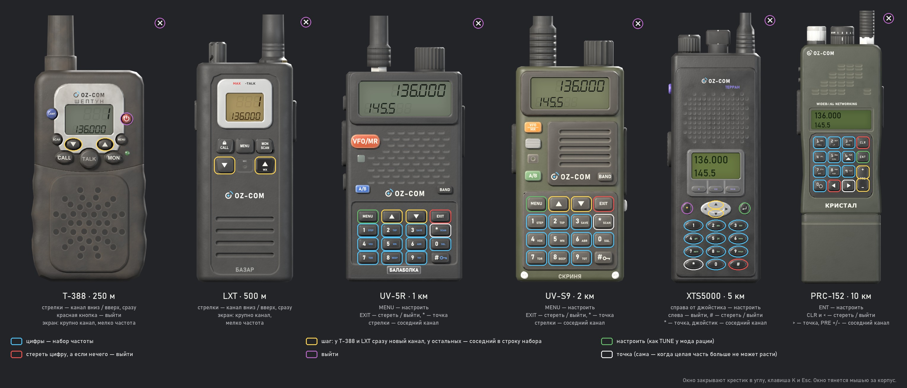

# Модели раций OpenZone Radio

Исходники моделей раций мода **OpenZone Radio** (Workshop 3794105144): у каждого класса
дальности своя рация — от детской «мыльницы» до армейской носимой станции; дальность — в описании
предмета, на корпусе и в названии её нет. Лицензия CC BY-NC-SA 4.0, см. `LICENSE` и `NOTICE`.


Модели — часть самого мода, отдельного аддона нет (с 25.09.2026). В игру идёт то, что лежит в
`OpenZone_Radio/`:

| где | что |
|---|---|
| `OpenZone_Radio/model/<рация>/` | модель (p3d), `model.cfg`, `data/` — текстуры и материалы |
| `OpenZone_Radio/config.cpp` | в классах `OZ_Radio_*`: `model`, лицо окна `ozrFace*`, `ozrPowerGesture`, материалы повреждений |
| `OpenZone_Radio/stringtable.csv` | имена `STR_OZR_RADIO_*`, подсказки лиц `STR_OZR_HINT_*` |
| `OpenZone_Radio/gui/faces/`, `gui/layouts/oz_face_*` | лица окна частот и их разметка |
| `OpenZone_Radio/scripts/5_Mission/OpenZone_Radio/OZR_FreqMenuFace.c` | окно частот лицом рации |
| `OpenZone_Radio/scripts/4_World/OpenZone_Radio/OZR_PowerGesture.c` | жест кнопки при включении (Шептун) |

А здесь, в `models/`, — из чего это собрано: скрипты каждой рации (`assets/<рация>/scripts`),
общий конвейер (`assets/_kit`: `radiokit.py` — геометрия, запекание, текстуры, экспорт p3d;
`texkit.py` — надписи), сцены Blender (`assets/<рация>/work/<рация>_high.blend` — детальная
модель, `_game.blend` — игровые лоды), инструменты окна частот, легенды и туториала (`tools/`)
и картинки (`docs/`).

## Рации

| папка | имя | по мотивам | класс | дальность |
|---|---|---|---|---|
| `pmr_t388` | Шептун | детская PMR T-388 | `OZ_Radio_250m` | 250 м |
| `lxt` | Базар | Midland LXT600 | `OZ_Radio_500m` | 500 м |
| `uv5r` | Балаболка | Baofeng UV-5R | `OZ_Radio_1000m` | 1 км |
| `uvs9` | Скриня | Baofeng UV-S9 (олива) | `OZ_Radio_2000m` | 2 км |
| `xts` | Терран | Motorola XTS5000 | `OZ_Radio_5000m` | 5 км |
| `prc152` | Кристал | AN/PRC-152 | `OZ_Radio_10000m` | 10 км |

Все рации — одной своей марки **OZ-COM** (так ванильная рация носит BIS-COM — имя студии), у
каждой модели своё имя. Имя напечатано на корпусе и стоит в названии предмета: «Рація OZ-COM
Балаболка». Настоящих марок и логотипов на моделях нет.

## Окно частот: что где нажимать / Frequency window legend / Вікно частот: що де натискати

Окно по клавише K показывает лицо рации в руках; цветом обведены клавиши, которые в нём работают.
The K window shows the face of the radio in hands; the coloured frames mark the keys that work in it.
Вікно за клавішею K показує лице рації в руках; кольором обведені клавіші, які в ньому працюють.

| RU | EN | UK |
|---|---|---|
|  |  |  |

Перерисовать: `python tools/render_hud_legend.py [--lang ru|en|uk]`.

Туториал для игроков одной картинкой: [RU](docs/tutorial.jpg) · [EN](docs/tutorial.en.jpg) · [UK](docs/tutorial.uk.jpg). Тексты en/uk - `tools/tutorial_i18n.py` поверх той же вёрстки; перерисовать: `python tools/render_tutorial.py [--lang ru|en|uk]`.

## Проверено в игре (24.09.2026, тогда ещё отдельным аддоном с лентой дальности)

Сервер и клиент грузили мод без ошибок в логе; все классы спавнились. Рация на 1 км сверена с
ванильной `PersonalRadio` как контрольной (на снимках ниже — ещё лента дальности, её с 25.09 нет):

- экран осмотра — модель стоит лицом к камере, марка, клавиатура читаются;
- в руке — хват ванильный (`PersonalRadio.anm`), от первого лица антенна вверх; в превью
  персонажа опущенная рука держит её антенной вниз — точно как ванильную;
- на земле — ложится лицом вверх;
- на лямке рюкзака (слот `WalkieTalkie`, HuntingBag) — вертикально, лицом наружу.

 

Самые крупные — PRC-152 (43 см с антенной) и XTS — отдельно: на лямке висят так же, как
UV-5R, антенна PRC уходит выше уха, в тело ничего не проваливается; в руке хват тот же.


## Сборка

Из папки `models/` (Blender 5.2 и системный Python с Pillow — пути в `tools/build_all.sh`):

```
bash tools/build_all.sh [рация ...]              полная сборка (без аргументов - все шесть)
bash tools/build_all.sh uv5r -- --passes albedo  перепечь только цвет (после правки печати)
bash tools/build_all.sh -- --skip-bake           без запекания, из work/bake (пути, лоды)
bash tools/build_all.sh -- --high-only           только детальные модели -> <рация>_high.blend
```

Сборка пишет текстуры, материалы и `model.cfg` прямо в `OpenZone_Radio/model/<рация>/`, а
исходную модель (MLOD) — в `build/model-root/OpenZone_Radio/model/<рация>/` (корень binarize).
Дальше в dayz-mcp, проект — корень репозитория: `asset_build(mod="OpenZone_Radio",
source="model/<рация>")` для каждой (кладёт бинаризованный p3d в мод; нужно, если менялась
геометрия или пути) → `mod_build` → стенд. Все пути внутри p3d и rvmat начинаются с
`OpenZone_Radio\model\`: переложить папку модели можно только пересборкой.

Лица окна частот после правки модели или раскладки: `blender -b -P tools/render_hud_faces.py`,
затем `python tools/make_hud_layouts.py` — пишут в `OpenZone_Radio/gui/`.

Общий снимок `docs/screenshots/lineup.jpg` — `blender -b -P tools/render_lineup.py`, берёт
игровые LOD1 из `assets/<рация>/work/<рация>_game.blend`.

## Как сделаны

Каждая рация — скрипты в `assets/<рация>/scripts`: раскладка (все размеры в одном файле),
печать надписей (Pillow) и сборка в Blender. Детальная модель (десятки тысяч треугольников, с
вырезами, винтами, рёбрами и надписями, спроецированными на грани) — только источник
запекания: игровые лоды строятся теми же функциями на меньшей детализации, развёртываются в один
атлас, и на него запекаются нормали, AO, цвет, шероховатость и металл. Подробности — в `AGENTS.md`.
