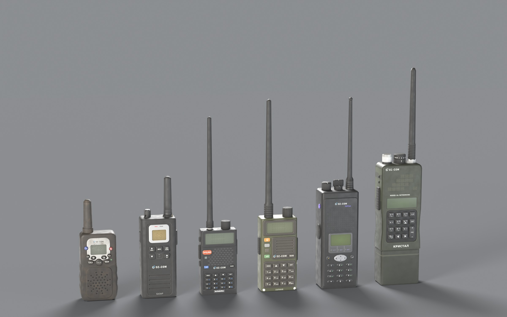

# OpenZone Radio: the radio models and how they are built

Sources of the six handheld models of **OpenZone Radio** (Workshop 3794105144): each range
class has a radio of its own, from a cheap children's walkie-talkie to a military man-portable
station. The range is in the item's description, not on the housing or in the name. Contributed
by Crystal (2026-09-25); licence CC BY-NC-SA 4.0, see `LICENSE` and `NOTICE` here (the assets'
provenance is in `NOTICE`).



The models are part of the mod itself, not a separate addon. What goes into the game lives in
`OpenZone_Radio/`; this folder holds what it is built from. The pictures for players (the
tutorial, the frequency-window legend, the lineup) live with the rest of the documentation in
[`docs/tutorial/`](../docs/tutorial/), and the tools here render them.

| where | what |
|---|---|
| `OpenZone_Radio/model/<radio>/` | the binarized p3d, `model.cfg`, `data/` with the `_co`/`_nohq`/`_smdi` textures and three rvmat (intact, damage, destruct) |
| `OpenZone_Radio/config.cpp` | in the `OZ_Radio_*` classes: `model`, the window face `ozrFace*`, `ozrPowerGesture`, `DamageSystem` |
| `OpenZone_Radio/stringtable.csv` | names `STR_OZR_RADIO_*`, descriptions `STR_OZR_RADIO_DESC_*`, face hints `STR_OZR_HINT_*` |
| `OpenZone_Radio/gui/faces/oz_face_*.edds`, `gui/layouts/oz_face_*.layout` | the frequency window as the radio's face |
| `OpenZone_Radio/scripts/5_Mission/OpenZone_Radio/OZR_FreqMenuFace.c` | the face window (a modded class of `OZR_FreqMenu` in the same module) |
| `OpenZone_Radio/scripts/4_World/OpenZone_Radio/OZR_PowerGesture.c` | the button-press power gesture (Шептун) |
| `models/assets/<radio>/scripts/` | each radio: the layout with every dimension, the label printing, the Blender build |
| `models/assets/_kit/` | the shared pipeline: `radiokit.py` (geometry, baking, textures, rvmat, model.cfg), `texkit.py` (labels, LCD), `p3d.py` (the MLOD writer) |
| `models/assets/<radio>/work/*.blend` | the Blender scenes: `<radio>_high.blend` the detailed model, `<radio>_game.blend` the in-game LODs |
| `models/tools/` | the window faces and layouts, the legend, the tutorial, the lineup |
| `models/docs/screenshots/` | in-game checks of the models |

Every path baked into a p3d or an rvmat starts with `OpenZone_Radio\model\`: relocating the model
folder means rebuilding, not moving.

## The radios

| folder | name on the case | modeled after | class | range | window |
|---|---|---|---|---|---|
| `pmr_t388` | Шептун | children's PMR T-388 | `OZ_Radio_250m` | 250 m | arrows step the channel; power by a button press |
| `lxt` | Базар | Midland LXT600 | `OZ_Radio_500m` | 500 m | arrows step the channel |
| `uv5r` | Балаболка | Baofeng UV-5R | `OZ_Radio_1000m` | 1 km | keypad, MENU confirms |
| `uvs9` | Скриня | Baofeng UV-S9 (olive) | `OZ_Radio_2000m` | 2 km | keypad, MENU confirms |
| `xts` | Терран | Motorola XTS5000 | `OZ_Radio_5000m` | 5 km | keypad, enter on the right |
| `prc152` | Кристал | AN/PRC-152 | `OZ_Radio_10000m` | 10 km | keypad, ENT confirms |

Latin transliteration, for reference: Sheptun, Bazar, Balabolka, Skrynia, Terran, Crystal.

**Brand and names** (the owner's choice, 2026-09-24 to 2026-09-25). All the radios share one
in-universe brand, **OZ-COM**, the way the vanilla radio carries BIS-COM. `texkit.brand()` draws
it: an open ring with a dot and a wave, the light-blue accent is `OZ_Palette.ACCENT` from
OpenZone Core, a single colour on the army radio and on metal. There is deliberately no separate
letter Z in the mark: the series' audience is Ukrainian-speaking. Each model has a one-word name
so it can be used in role-play («buy a couple of Балаболок»); it is printed on the housing in
Cyrillic (`MODEL` in `layout_<radio>.py`, `PRODUCT` for the PRC) and appears in the item's name
(`displayName` in `config.cpp` → `STR_OZR_RADIO_<model>` in `stringtable.csv`). Change a name in
both places. The "modeled after" names are for finding reference material only; nothing of them
is on the models, and no real brand or logo is either.

Six classes remain, one per model: 250, 500, 1000, 2000, 5000 and 10000 m (the owner's
decision of 2026-09-25); 50, 100, 200 and 750 m are kept as comments in `config.cpp`. There is no
range tape on the models any more and no range in the item names: the range is only in each
radio's own description (`STR_OZR_RADIO_DESC_<model>`: what the set is, how far it reaches, how
it tunes).

## Pictures for players

- The tutorial, one picture: [EN](../docs/tutorial/tutorial.en.jpg) ·
  [UK](../docs/tutorial/tutorial.uk.jpg). `tools/tutorial.html` is the English page,
  `tools/tutorial_i18n.py` the Ukrainian phrases laid over it; the shot is taken with headless
  Chrome: `python tools/render_tutorial.py [--lang en|uk]`.
- The frequency-window legend, which keys do what on each face:
  [EN](../docs/tutorial/hud_legend.en.jpg) · [UK](../docs/tutorial/hud_legend.uk.jpg);
  `python tools/render_hud_legend.py [--lang en|uk]`.
- The lineup of the six: `blender -b -P tools/render_lineup.py` (the in-game LOD1 from
  `<radio>_game.blend`).

Both renderers need the radio faces from `assets/<radio>/work/hud/face.png` (see "The frequency
window" below) and the game's seven-segment font: `gui/fonts/7segment.ttf` out of the game's
`dta/gui.pbo` (BankRev from DayZ Tools), placed at `models/build/fonts/7segment.ttf` or named by
`OZ_SEG_TTF`; without it the digits fall back to the text font.

## Build

From the `models/` folder, with Blender 5.2 and a system Python that has Pillow (Blender's own
Python has numpy, the system one does not; the paths are in `tools/build_all.sh`):

```
bash tools/build_all.sh [radio ...]              full build (no arguments: all six)
bash tools/build_all.sh uv5r -- --passes albedo  re-bake the colour only (after touching up a print)
bash tools/build_all.sh -- --skip-bake           no baking, from work/bake (paths, LODs)
bash tools/build_all.sh -- --high-only           the detailed models only -> <radio>_high.blend
```

One radio by hand, in this order: `python make_prints_<radio>.py` → `blender -b -P
build_<radio>.py` (`-- --high-only`, `-- --skip-bake`, `-- --passes albedo` as above) →
`asset_build(mod="OpenZone_Radio", source="model/<radio>")` in dayz-mcp (the project is the
repository root) → `mod_build` → the stand.

The build writes the textures, the rvmat and `model.cfg` straight into
`OpenZone_Radio/model/<radio>/`, and the source model (MLOD) into
`build/model-root/OpenZone_Radio/model/<radio>/`, the binarize root (`[build] project_root` in
`dayz-mcp.toml`); `asset_build` binarizes it and puts the ODOL into the mod. After touching up a
single print it is enough to re-bake the colour and run `mod_build`. A finished ODOL contains
`openzone_radio\model\` strings and no foreign prefix.

Three paths differ per machine and are resolved by `assets/_kit/radiokit.py` with environment
overrides: the unpacked vanilla data that the binarize root links to as `dz\` (`OZ_VANILLA_DZ`;
the DayZ Tools project drive, `E:\pdrive` on the owner's machine, `D:\modding\PDrive` on the
contributor's), `ImageToPAA` from DayZ Tools (`OZ_IMAGE_TO_PAA`), and the `dayz-modding` skill's
`scripts/` folder, found under the user's home.

Of `work/`, only the two `.blend` files per radio are in git: everything else there (the baked
`bake/*.npy`, about 1 GB per radio, the textures, the renders) is reproduced by the scripts. The
`.blend` files reference images from `work/` and `textures/`, so open them after a build.

### How a radio is structured

```
assets/_kit/radiokit.py        the shared toolkit (Blender Python): parts, materials, LODs,
                               unwrapping, baking, textures, rvmat, model.cfg, p3d
assets/_kit/texkit.py          labels, LCD (system Python + Pillow)
assets/_kit/p3d.py             the MLOD writer (and a reader for checks)
assets/<radio>/scripts/
  layout_<radio>.py            every dimension and the layout, read by the geometry and the printing alike
  make_prints_<radio>.py       face, side and back labels, the LCD -> textures/
  build_<radio>.py             build(m) by level: 0 the detailed model, 1..4 the in-game LODs
```

The detailed model (tens of thousands of triangles, with cutouts, screws, ridges and labels
projected onto the faces) is only a baking source: the in-game LODs are built by the same
functions at lower detail, unwrapped into a single atlas, onto which normals, AO, colour,
roughness and metal are baked.

### The frequency window as the radio's face (K)

On K the mod opens one window for every radio (`OZR_FreqMenu`). `OZR_FreqMenuFace.c` gives it
the face of the radio in hand; the layout's buttons carry the window's own button names
(`Btn0..9`, `BtnUp/Down`, `BtnGo`, `BtnDot`, `BtnClose`, `DragBar`), so typing, the band check
and the request to the server work as they are. Added on top: `BtnBack` (erase, or exit when
there is nothing to erase), a `step` mode for the radios without digits (T-388, LXT: the arrow
switches the channel at once, the window stays open), an auto-dot, a two-row screen. Which face a
class gets is the `ozrFace*` fields of its class in `config.cpp`; a class without them gets the
plain window.

```
tools/hud_spec.py           mode, scale, screen style and the KEY ROLES per radio
tools/render_hud_faces.py   Blender: the LOD1 face from <radio>_game.blend -> work/hud/face_raw.png
tools/make_hud_layouts.py   cleans the screen, writes work/hud/face.png, the .edds and the .layout
```

- **After changing a radio's model or `layout_<s>.py`, regenerate its window**:
  `blender -b -P tools/render_hud_faces.py -- <radio>`, then
  `python tools/make_hud_layouts.py <radio>`. The layout is read fresh, but the face picture is
  the old model's until it is re-rendered, and then the key zones and the screen drift apart (it
  happened with the T-388 on 2026-09-24).
- The window textures are `.edds` with LINEAR values, which the generator handles: the interface
  encodes pixels to sRGB on output, so anything written as-is comes out washed out, a `.paa` with
  any suffix included. Details in the `dayz-modding` skill, hud.md.
- On the stand: the radio in hand (`world_spawn ... hands`), a `Battery9V` inside, `world_power`,
  K, then `ui_find`/`ui_click` by the button names (the dayz-mcp bridge has to load on the client
  as well: `server_only = []` in the local toml).

### Model frame (taken from the vanilla WalkieTalkie.p3d)

- In Blender: X right, Y back (the face points -Y), Z up; the origin is the centre of the
  housing's bottom.
- In the p3d: `(x, y, z) = (x_b, z_b, y_b)`, the face points -Z like the vanilla radio. The
  `PersonalRadio.anm` grip and the backpack-strap slot are built for this frame, so every
  `PersonalRadio` descendant gets the grip from vanilla with no scripting.

### Budgets

- 4 visual LODs, roughly halving at each step; `lodnoshadow = 1` on all of them, like vanilla.
- Geometry: `autocenter = 0`, mass 0.25 kg, two convex components (housing and antenna, like
  vanilla); Fire Geometry: the housing `plastic_material`, the antenna `rubber`.
- One atlas per radio: `_co` and `_nohq` 2048 (baked at 4096 and downscaled), `_smdi` 1024;
  normals in DirectX format.
- The p3d name is unique and starts with `oz_radio_`.

## Verified in-game (2026-09-24, still as a separate addon with the range tape)

Server and client loaded the mod with no errors in the log; every class spawned. The 1 km radio
was checked against the vanilla `PersonalRadio` as a control (the screenshots still show the
range tape, gone since 2026-09-25):

- the inspection screen: the model faces the camera, the brand and the keypad are legible;
- in hand: the vanilla grip (`PersonalRadio.anm`), in first person the antenna points up; in the
  character preview the lowered hand holds it antenna-down, exactly like the vanilla radio;
- on the ground: it lies face up;
- on the backpack strap (slot `WalkieTalkie`, HuntingBag): vertical, face outward.

 

The largest ones, the PRC-152 (43 cm with the antenna) and the XTS, separately: on the strap they
hang like the UV-5R, the PRC's antenna rises above ear level, nothing clips into the body; the
grip in hand is the same.


On 2026-09-26 the six sets were spawned and seen on the owner's stand as part of the base mod:
textured on the ground and in hand, no model, texture or material error in the client's RPT.

## Working rules

The rules of the repository apply here (English or Ukrainian only, the series' conventions in
the root README and CLAUDE.md); on top of them, for this folder:

- Commit before the session ends; a message says *why*, not *what*.
- Read the `dayz-modding` skill before touching models, materials or configs: the engine's
  gotchas live in its `references/`. The unpacked vanilla data (the DayZ Tools project drive) is
  the reference for any value in an rvmat, a config or a LOD's named property.
- The stand is the repository's dayz-mcp project: a dedicated server with the frequency proxy
  (`hid.dll` + `oz_frequencies.json` beside `DayZServer_x64.exe`, the `proxy-v1.0.0` release
  built from `native/src`), otherwise the radio runs on the vanilla eight frequencies. The proxy
  does not go into the client folder: BattlEye blocks an unsigned DLL. Its log
  `oz_frequencies.log` should say `patched: redirected 12 bytes` and `channels: 400`; the mod
  writes the grid into `<stand_root>/profiles/OpenZone/OZ_Radio_Frequencies.json`.
