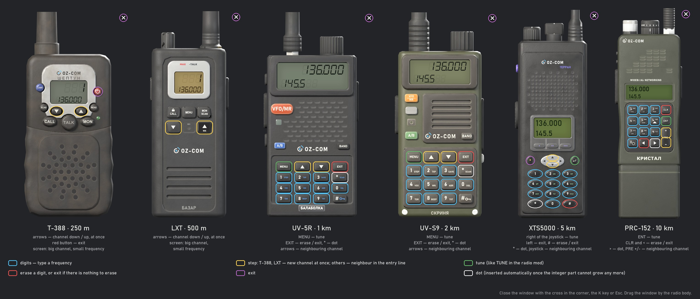
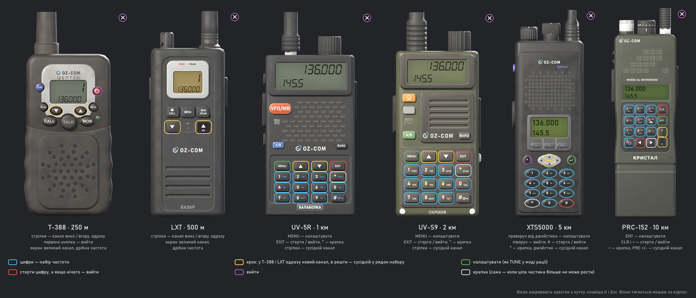
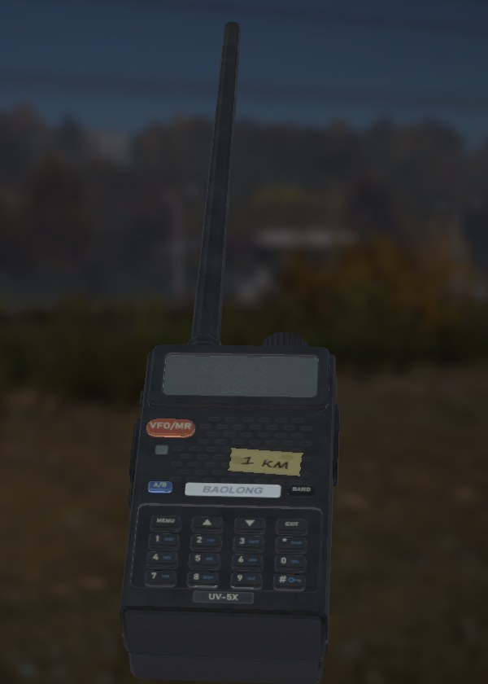
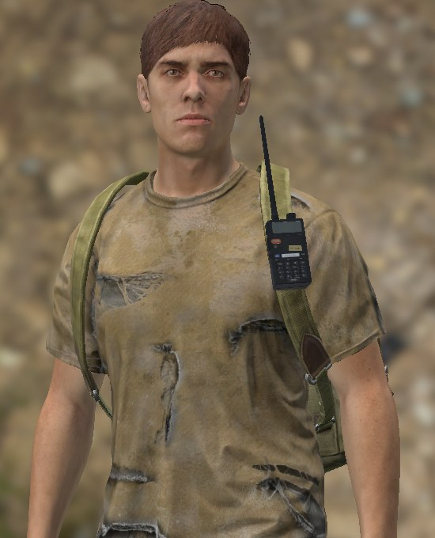
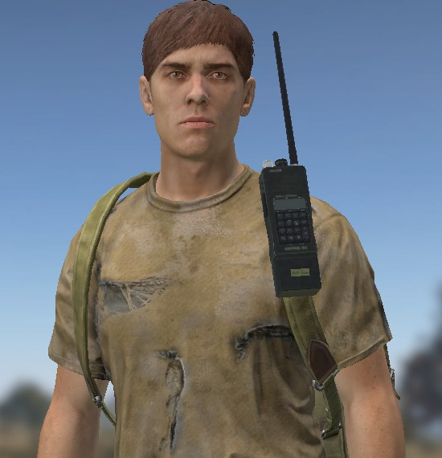
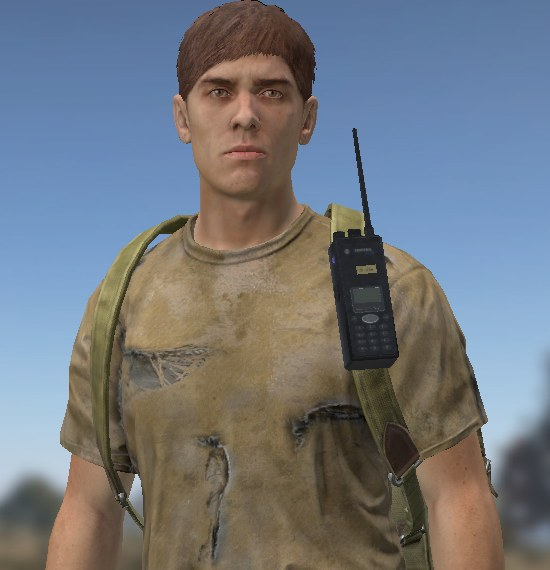
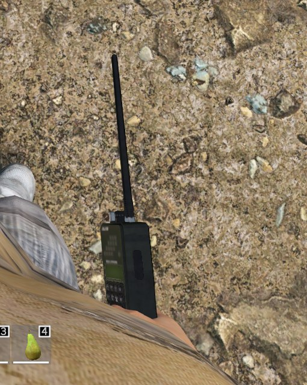

# OpenZone Radio radio models

Sources of the radio models for the **OpenZone Radio** mod (Workshop 3794105144): each range
class has its own radio — from a cheap children's walkie-talkie to a military man-portable
station; the range is in the item's description, not on the housing or in the name. License
CC BY-NC-SA 4.0, see `LICENSE` and `NOTICE`.


The models are part of the mod itself; there is no separate addon (as of 2026-09-25). What goes
into the game is what lives in `OpenZone_Radio/`:

| where | what |
|---|---|
| `OpenZone_Radio/model/<radio>/` | model (p3d), `model.cfg`, `data/` — textures and materials |
| `OpenZone_Radio/config.cpp` | in the `OZ_Radio_*` classes: `model`, window face `ozrFace*`, `ozrPowerGesture`, damage materials |
| `OpenZone_Radio/stringtable.csv` | names `STR_OZR_RADIO_*`, face hints `STR_OZR_HINT_*` |
| `OpenZone_Radio/gui/faces/`, `gui/layouts/oz_face_*` | frequency window faces and their layout |
| `OpenZone_Radio/scripts/5_Mission/OpenZone_Radio/OZR_FreqMenuFace.c` | frequency window as a radio face |
| `OpenZone_Radio/scripts/4_World/OpenZone_Radio/OZR_PowerGesture.c` | power button gesture (Шептун) |

And here, in `models/`, is what it's built from: each radio's scripts (`assets/<radio>/scripts`),
the shared pipeline (`assets/_kit`: `radiokit.py` — geometry, baking, textures, p3d export;
`texkit.py` — labels), Blender scenes (`assets/<radio>/work/<radio>_high.blend` — the detailed
model, `_game.blend` — the in-game LODs), the frequency-window, legend, and tutorial tools
(`tools/`), and the pictures (`docs/`).

## Radios

| folder | name | modeled after | class | range |
|---|---|---|---|---|
| `pmr_t388` | Шептун | children's PMR T-388 | `OZ_Radio_250m` | 250 m |
| `lxt` | Базар | Midland LXT600 | `OZ_Radio_500m` | 500 m |
| `uv5r` | Балаболка | Baofeng UV-5R | `OZ_Radio_1000m` | 1 km |
| `uvs9` | Скриня | Baofeng UV-S9 (olive) | `OZ_Radio_2000m` | 2 km |
| `xts` | Терран | Motorola XTS5000 | `OZ_Radio_5000m` | 5 km |
| `prc152` | Кристал | AN/PRC-152 | `OZ_Radio_10000m` | 10 km |

Latin transliteration, for reference: Sheptun, Bazar, Balabolka, Skrynia, Terran, Crystal.

All the radios share one in-universe brand, **OZ-COM** (the same way the vanilla radio carries
BIS-COM — the studio's name), with each model having its own name. The name is printed on the
housing and appears in the item's name: «Рація OZ-COM Балаболка». There are no real brands or
logos on the models.

## Frequency window legend / Вікно частот: що де натискати

The K window shows the face of the radio in hands; the coloured frames mark the keys that work in it.
Вікно за клавішею K показує лице рації в руках; кольором обведені клавіші, які в ньому працюють.

| EN | UK |
|---|---|
|  |  |

To re-render: `python tools/render_hud_legend.py [--lang en|uk]`.

A one-picture tutorial for players: [EN](docs/tutorial.en.jpg) · [UK](docs/tutorial.uk.jpg). The
en/uk text is `tools/tutorial_i18n.py` layered over the same layout; to re-render:
`python tools/render_tutorial.py [--lang en|uk]`.

## Verified in-game (2026-09-24, when it was still a separate addon with a range tape)

The server and client loaded the mod with no errors in the log; every class spawned. The 1 km
radio was checked against the vanilla `PersonalRadio` as a control (the screenshots below still
show the range tape, which has been gone since 2026-09-25):

- inspection screen — the model stands face-on to the camera, the brand and keypad are legible;
- in hand — the grip is the vanilla one (`PersonalRadio.anm`), in first person the antenna points
  up; in the character preview the lowered hand holds it antenna-down — exactly like the vanilla
  radio;
- on the ground — it lies face up;
- on the backpack strap (slot `WalkieTalkie`, HuntingBag) — vertical, face outward.

 

The largest ones — the PRC-152 (43 cm with the antenna) and the XTS — separately: on the strap
they hang the same way as the UV-5R, the PRC's antenna rises above ear level, and nothing clips
into the body; the grip in hand is the same.





## Build

From the `models/` folder (Blender 5.2 and the system Python with Pillow — paths are in
`tools/build_all.sh`):

```
bash tools/build_all.sh [radio ...]              full build (with no arguments — all six)
bash tools/build_all.sh uv5r -- --passes albedo  re-bake only the color (after touching up the print)
bash tools/build_all.sh -- --skip-bake           no baking, from work/bake (paths, LODs)
bash tools/build_all.sh -- --high-only           detailed models only -> <radio>_high.blend
```

The build writes textures, materials, and `model.cfg` directly into
`OpenZone_Radio/model/<radio>/`, and the source model (MLOD) into
`build/model-root/OpenZone_Radio/model/<radio>/` (the binarize root). Next, in dayz-mcp, with the
project set to the repository root: `asset_build(mod="OpenZone_Radio", source="model/<radio>")`
for each one (this puts the binarized p3d into the mod; needed if the geometry or paths changed)
→ `mod_build` → the stand. All paths inside the p3d and rvmat start with `OpenZone_Radio\model\`:
the model folder can only be relocated by rebuilding.

Frequency-window faces after editing the model or the layout: `blender -b -P
tools/render_hud_faces.py`, then `python tools/make_hud_layouts.py` — they write into
`OpenZone_Radio/gui/`.

The group shot `docs/screenshots/lineup.jpg` — `blender -b -P tools/render_lineup.py`, it takes
the in-game LOD1 from `assets/<radio>/work/<radio>_game.blend`.

## How they're made

Each radio is scripts in `assets/<radio>/scripts`: the layout (all dimensions in one file),
printing the labels (Pillow), and the Blender assembly. The detailed model (tens of thousands of
triangles, with cutouts, screws, ridges, and labels projected onto the faces) is only a baking
source: the in-game LODs are built by the same functions at lower detail, unwrapped into a single
atlas, onto which the normals, AO, color, roughness, and metal are baked. Details are in
`AGENTS.md`.
